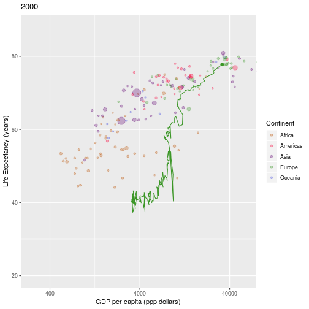

In this section we'll look at how to interact with the graph.  When we click on a graph we will show the name of the country that has been selected, and show this historic data for the country on the graph. For example:


```r
historicdata <- gapminder %>% 
  filter(year <= 2000) %>% 
  filter(country == "United Kingdom")

# addHistoricPlot() will add a trace showing the trajectory of a country
# to an existing plot:
gapminder %>% 
  filter(year == 2000) %>% 
  produceGapminderPlot() %>% 
  addHistoricPlot(historicdata)
```



You should complete the [reactive data]()


There are a number of steps to go through to get to this point:

1. Returning the co-ordinates of the graph when we click on it
2. Working out which point (i.e. country) is closest to where we clicked
3. Generating the `historicdata` set, to show the "trace"
4. Adding the historic data to the plot.

## Getting the graph co-ordinates

The `plotOutput()` function (in the user interface) takes a `click` option, which will return the co-ordinates of the graph when it is selected.  

