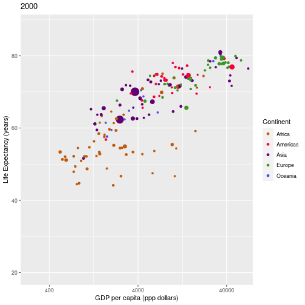
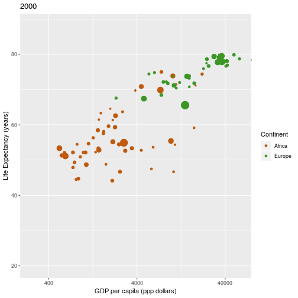

### Chapter 3

# Producing plots


## Plotting a "gapminder" graph

In order to avoid getting bogged down on the syntax of ggplot2, a function to produce a "gapminder" plot is provided in the `workshopFunctions.R` file, which we load at the start of our app (See [02_loaddata](https://github.com/UoMResearchIT/r-shiny-course-materials/commit/f634302b6cdcc46c7d543ccb90f0cad49f7a32ab) ).  This uses ggplot2 to produce a graph, deals with setting fixed axes, consistent colours etc.

If you haven't already, set R's working directory to that of your app (`setwd("~/myworkshop/gapminder)`).  Then manually execute the lines of code that load the libraries, data and code by selecting them and pressing Ctrl+Enter. 

Having loaded the data, libraries and functions, we can produce a gapminder plot in R using the following code:


```r
gapminder %>% 
  filter(year == 2000) %>% 
  produceGapminderPlot()
```




## Exercise:

Add another `filter` to the example to only show countries that are in Europe and Africa

## Solution:
{}

```r
gapminder %>% 
  filter(year == 2000) %>% 
  filter(continent %in% c("Europe", "Africa")) %>% 
  produceGapminderPlot()
```




{}

{}
Further examples of using the plotting functions are given in the `codeExamples.R` file, which is in the [course materials zip file](https://github.com/UoMResearchIT/r-shiny-course/raw/master/runningExample.zip).
{}
